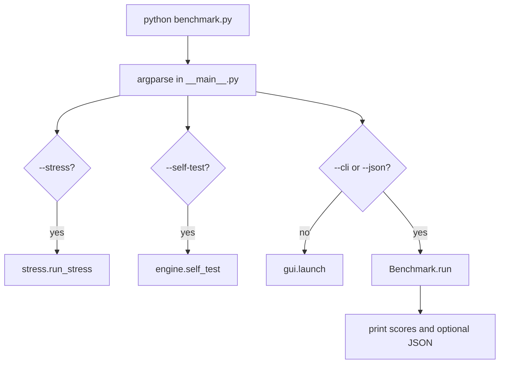
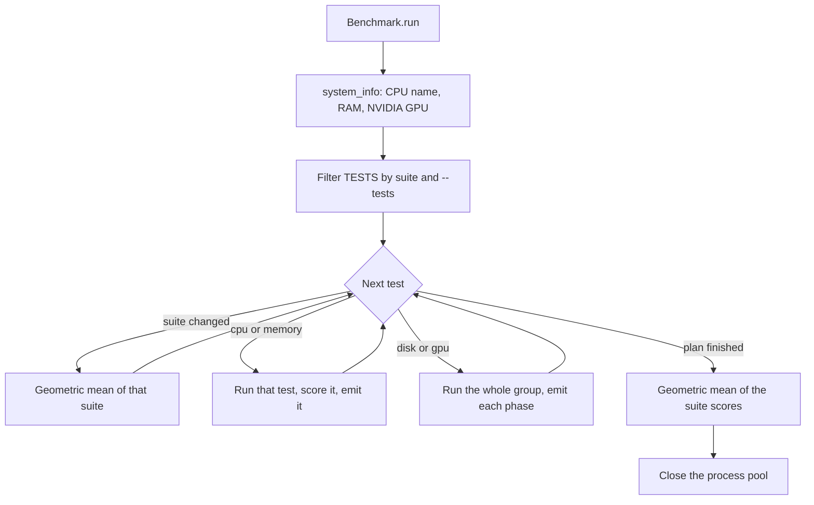
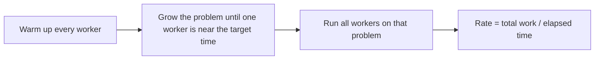
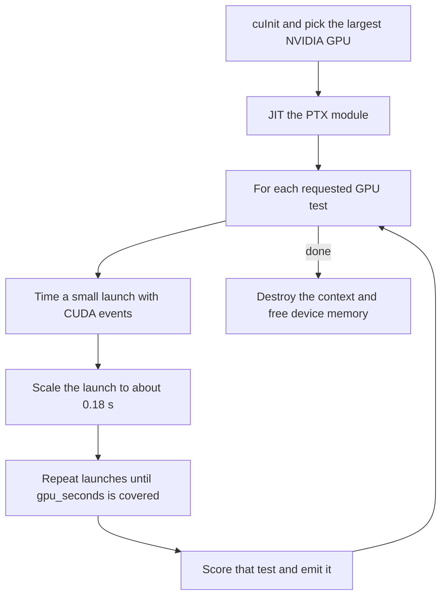
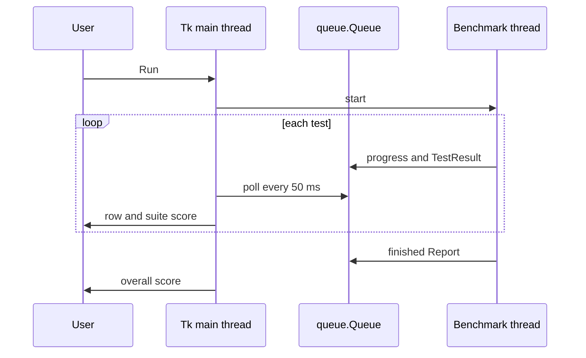
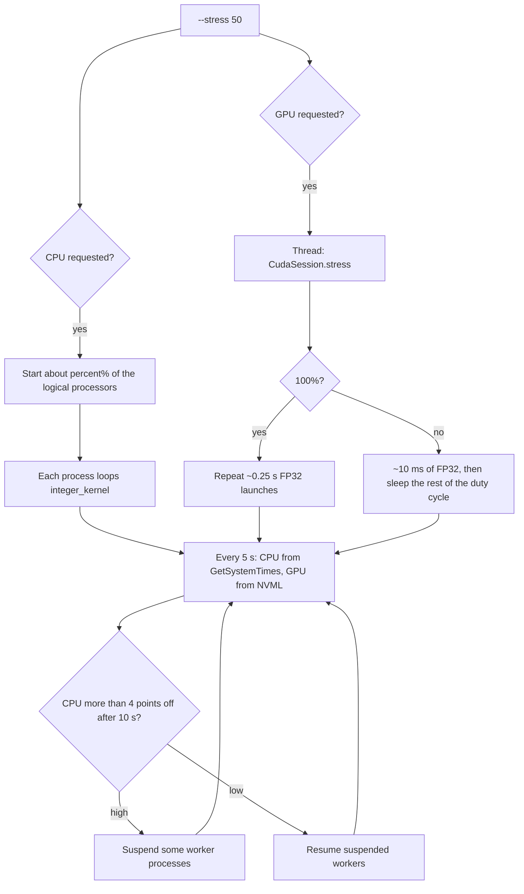

# PyFormance

Local Windows benchmark for CPU, memory, disk, and an NVIDIA GPU. A score of 100 matches the built-in reference for that test. 200 is twice as fast.

Each suite score is the geometric mean of its tests. The overall score is the geometric mean of the CPU, memory, disk, and GPU scores, so each suite counts equally. These are PyFormance points, not another vendor's benchmark marks.

Python 3.10 or newer is enough. The GPU tests use the NVIDIA driver already installed on the machine. No extra Python packages are required.

## Run

From this folder:

```text
python benchmark.py
```

That opens the window. Choose CPU, memory, disk, and GPU, then run. With no mode flag, the window is the default.

Print a report in the terminal:

```text
python benchmark.py --cli
python benchmark.py --cli --quick
python benchmark.py --cli --tests cpu,gpu
python benchmark.py --cli --tests sha256,gpu_fp32
python benchmark.py --cli --workers 8 --json results.json
```

`--quick` is a shorter pass. `--tests` takes suite names or individual test ids. `--workers` sets how many processes the CPU tests use. The default is every logical processor. `--json` writes the same run to a file. `--self-test` checks the math kernels, the worker pool, a small disk run, and the GPU.

Each test prints its result and score as soon as it finishes. The suite score prints when that suite is done. The overall score prints at the end.

## Stress

Hold a load until Ctrl+C. The status line shows the measured CPU and GPU use.

```text
python benchmark.py --stress
python benchmark.py --stress 50
python benchmark.py --stress 25
python benchmark.py --stress cpu
python benchmark.py --stress gpu
```

`--stress` with no number loads both devices fully. A number from 1 to 100 loads both near that percent. `cpu` and `gpu` stress only that device, at 100%. The CPU figure is the whole machine, so other programs can hold it a little above the number you asked for. It takes a few seconds to settle.

The GPU number comes from the NVIDIA driver. In Task Manager, switch the GPU graph from 3D to Compute. CUDA work does not show on the 3D graph.

## Tests

| Suite | Id | What it measures |
| --- | --- | --- |
| cpu | `integer` | Integer math |
| cpu | `float` | Floating-point math |
| cpu | `primes` | Prime search |
| cpu | `sort` | Sorting |
| cpu | `sha256` | SHA-256 |
| cpu | `compress` | Compression |
| cpu | `physics` | Particle physics |
| cpu | `single` | Single thread |
| memory | `mem_copy` | Copy bandwidth |
| memory | `mem_read` | Read bandwidth |
| memory | `mem_write` | Write bandwidth |
| memory | `chase` | Pointer chase |
| disk | `disk_write` | Sequential write |
| disk | `disk_read` | Sequential read |
| disk | `disk_rand` | Random 4 KB read |
| gpu | `gpu_fp32` | FP32 compute |
| gpu | `gpu_fp16` | FP16 compute |
| gpu | `gpu_fp64` | FP64 compute |
| gpu | `gpu_sfu` | Special functions |
| gpu | `gpu_int` | Integer compute |
| gpu | `gpu_int64` | 64-bit integer |
| gpu | `gpu_bit` | Bitwise |
| gpu | `gpu_bw` | Global copy |
| gpu | `gpu_read` | Global read |
| gpu | `gpu_write` | Global write |
| gpu | `gpu_l2` | L2 cache |
| gpu | `gpu_shared` | Shared memory |
| gpu | `gpu_stride` | Random access |

Disk tests write a temporary file with unbuffered I/O and delete it afterward. GPU tests use the NVIDIA GPU with the most memory. An Intel integrated GPU is not used. If the NVIDIA driver is missing, the other suites still run.

## How the code works

`benchmark.py` is only a launcher. It puts the parent of this folder on `sys.path` and calls `pyformance.__main__.main`. That matters when you run the script from inside `pyformance\`, because Python would otherwise search for a nested package that is not there.

`main` reads the flags and picks one path. A benchmark and a stress run never share a process lifetime.



| File | Role |
| --- | --- |
| `benchmark.py` | Launcher. Fixes `sys.path`, then calls `main`. |
| `__main__.py` | Flags, help text, and the branch above. |
| `engine.py` | The run plan, timings, scores, disk measurement, and the text report. |
| `kernels.py` | CPU and memory work. These functions are imported by worker processes. |
| `diskio.py` | `kernel32` `CreateFile` / `ReadFile` / `WriteFile` with unbuffered flags. |
| `gpu.py` | CUDA driver API through `nvcuda.dll`, the PTX kernels, and GPU stress. |
| `gui.py` | Tk window. It never calls Tk from the benchmark thread. |
| `stress.py` | CPU processes, the GPU stress thread, and the 5-second load line. |

Worker functions live in `kernels.py` on purpose. On Windows, `ProcessPoolExecutor` uses the `spawn` start method, which re-imports the function's module in the child. A lambda or a function defined under `__main__` cannot be spawned.

### One benchmark run

`Benchmark.run` in `engine.py` owns the sequence. CPU and memory tests run one at a time. Disk and GPU are groups: one session produces several scores, and each score is handed back as soon as that phase finishes.



Default target times are about 1.6 s for each CPU test, 1.35 s for memory, 1.15 s for disk, and 1.25 s for each GPU test. `--quick` cuts those to a few tenths of a second and shrinks the disk file and some GPU buffers. The runner first times a small sample, then scales the work so the timed pass lands near that target.

A test score is `100 * measured / baseline`. The baselines live in `_BASELINES` in `engine.py`. A failed test stores `score = None` and the rest of the run continues. The geometric mean skips those failures. An empty suite is left out of the overall score.

`100` is the built-in reference rate for that one test. It is not a percentage of your hardware's theoretical peak, and it is not scaled so that this machine scores 100.

### CPU and memory

Pure Python work cannot use extra cores while it holds the GIL, so integer math, floating point, primes, sorting, physics, and the single-thread test run in a `ProcessPoolExecutor`. SHA-256 and zlib release the GIL, so those two use a `ThreadPoolExecutor` instead. The single-thread test is the integer kernel on the main process, with one worker's worth of work.



The pool is created on the first CPU test and shut down in `Benchmark.close`, including when you stop early. Each kernel returns a checksum so the work stays live and is not optimized out.

Memory copy, read, and write also use that process pool. Each worker builds its own buffer, times only the inner loop, and returns that elapsed time. The rate uses the slowest worker, so a process that starts late does not inflate the bandwidth. Copy fills the source before the timer. Read counts bytes. Write fills with `memset`. The pointer chase builds one large linked table and walks it on the main process. That test is about latency, not aggregate bandwidth.

### Disk

`_measure_disk` creates a temporary directory and writes `sample.bin`. A short probe tries `FILE_FLAG_NO_BUFFERING` plus write-through. If the drive rejects that, the rest of the disk run uses ordinary buffered I/O and the result text says so. Unbuffered I/O is what keeps the filesystem cache from reporting RAM speed as disk speed.

The probe rate sets the file size: about `disk_seconds` of data, at least 128 MB on a full run and at most 2 GB, while leaving 512 MB free. Writes and reads use 1 MB blocks. The read checks that the first 64 bytes match what was written. Random I/O is 4 KB reads spread across that file. The temporary directory is deleted in a `finally` block even when a phase fails. Phases that already finished keep their scores.

### GPU

`gpu.py` talks to `nvcuda.dll` with `ctypes`. There is no CUDA toolkit and no display library. `CudaSession` picks the NVIDIA device with the most memory, creates a context on the calling thread, and loads one PTX module with `cuModuleLoadDataEx`. The PTX targets `sm_70` and is JIT-compiled by the driver for the real chip. A load failure fails the GPU group. A later kernel failure records that test as failed and continues with the next one.



Each timed launch is kept near 0.18 s, and shrunk again if a chunk exceeds 0.4 s, so a single kernel stays under the Windows display timeout of about 2 s. Timing uses CUDA events around the launch, not the Python clock, so driver submit time is outside the measurement. Compute kernels write a sink buffer so the work cannot be deleted. Copy, read, and write kernels move 128 MB in a quick run and 512 MB in a full run. The write kernel is checked against the bytes it was supposed to store.

FP32 and integer kernels keep independent chains so the ALUs stay busy. FP16, FP64, and 64-bit integer chains are cross-coupled so the compiler cannot collapse the loop into a closed form. The reported FLOPs count an FMA as two operations. Task Manager's 3D engine does not count this work. The Compute engine does.

### The window

Tk is not thread-safe. The Run button starts a daemon thread that owns `Benchmark.run`. That thread only pushes callbacks onto a `queue.Queue`. The main thread drains the queue every 50 ms from `root.after` and then updates the tree, the progress bar, and the score cards. Calling `winfo_exists` or `after` from the worker raises `RuntimeError` because the worker is not in the Tk loop.



Stop sets an `Event`. The runner finishes the test it is in, then exits the plan. Closing the window sets that event and shuts the process pool.

### Stress

`--stress` does not build a `Benchmark`. `stress.run_stress` starts the requested devices and blocks until Ctrl+C.



A partial CPU load pegs whole logical processors instead of pausing inside every worker. Pausing inside all 32 workers ran hot, because the sleeps did not line up with the scheduler. For 50% of 32 threads, 16 processes run the integer kernel with no sleep. Any fractional core left over is one extra process that works and sleeps. After 10 seconds, if the machine is still more than about 4 points away from the request, workers are suspended or resumed with `NtSuspendProcess` / `NtResumeProcess`. The printed CPU number is the whole system, so other programs count.

GPU stress at 100% keeps launching the FP32 kernel in chunks of about 0.25 s. A lower percent uses short slices and sleeps so the GPU-busy fraction matches the request. The status line averages NVML samples across those 5 seconds. NVML's own sample is short, and one instant reading would bounce between 0% and a spike.

Ctrl+C sets the stop event, asks the GPU thread to return, and terminates the CPU processes. If the GPU session fails during a both-device run, the error is printed and the CPU workers keep going. A GPU-only failure exits.
